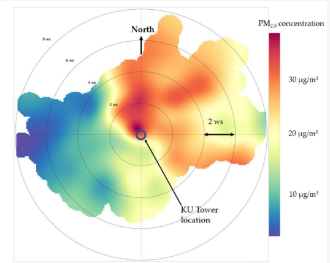

# Polar plots and annulus

Use polar plots when you want pollutant behaviour expressed jointly by wind speed and wind direction.

{ width="420" }

These plots are useful when a simple directional rose is not enough and you want to see whether elevated concentrations are associated with:

- a narrow set of wind sectors
- specific wind-speed ranges
- plume-like source signatures

Core functions:

- `polar_plot()`
- `polar_annulus()`

## Interpretation

- `polar_plot()` is a gridded surface over wind direction and wind speed
- `polar_annulus()` is useful when you want a more ring-like presentation of the same directional-speed space

In both cases, strong localised hotspots can suggest source directions or transport regimes worth following up in maps or trajectories.

## Example

```python
import airqoair as aq

aq.polar_plot("kampala.csv", pollutant="pm2_5").save("outputs/polar_plot.png")
aq.polar_annulus("kampala.csv", pollutant="pm2_5").save("outputs/polar_annulus.png")
```
