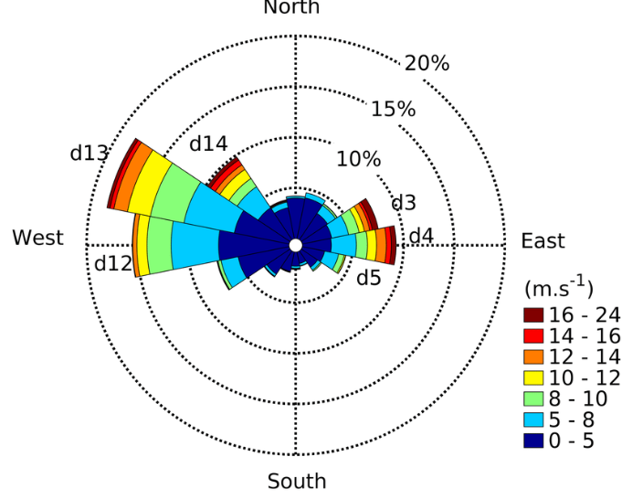

# Wind and pollution roses

Directional analysis is often the fastest way to connect pollution with transport pathways.

{ width="420" }

Use these plots when you want to ask questions like:

- which wind directions occur most often?
- which sectors are associated with high pollutant levels?
- which sectors are associated with extreme values rather than typical ones?

Core functions:

- `wind_rose()`
- `pollution_rose()`
- `percentile_rose()`
- `polar_frequency()`

## When To Use Each Function

- `wind_rose()` for the distribution of wind direction and wind-speed classes
- `pollution_rose()` for average or median pollutant behaviour by wind sector and wind speed
- `percentile_rose()` when you care about high-end episodes rather than central tendency
- `polar_frequency()` when you want a gridded directional-frequency surface

## Example workflow

Start with a wind rose to understand air-flow behaviour, then move to a pollution rose or percentile rose to connect that behaviour to concentrations.

## Example

```python
import airqoair as aq

aq.wind_rose("kampala.csv").save("outputs/wind_rose.png")
aq.pollution_rose("kampala.csv", pollutant="pm2_5").save("outputs/pollution_rose.png")
```
