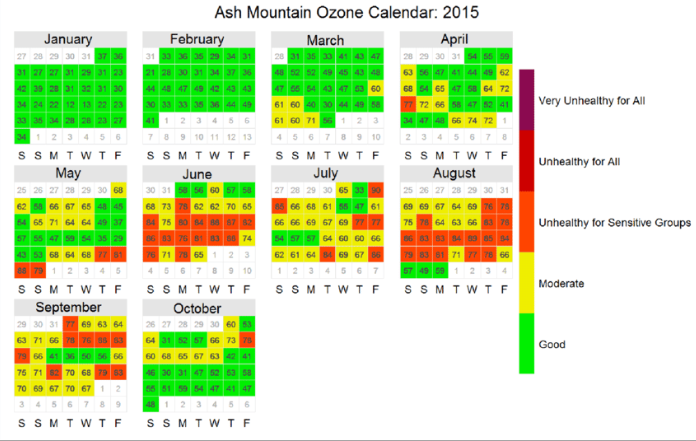

# Calendar plots

`calendar_plot()` arranges daily values in a true calendar layout, month by month.

{ width="460" }

This view is useful when you want to inspect daily variability while keeping the seasonal and monthly context visible.

Useful options:

- `year=` to focus on one or more years
- `annotate="value"` to label each day with its daily value
- `annotate="ws"` to show daily mean wind arrows when `ws` and `wd` are present
- `breaks=` and `labels=` to define discrete bands
- `lim=` to flag values above a threshold

## Typical Uses

- scan a year for sustained high-pollution periods
- identify whether extremes cluster in certain months
- compare high days with concurrent wind direction indicators

## Example

```python
import airqoair as aq

aq.calendar_plot(
    "kampala.csv",
    pollutant="pm2_5",
    year=2025,
    annotate="value",
    breaks=[0, 15, 35, 55, 150],
    labels=["Good", "Moderate", "Unhealthy", "Very Unhealthy"],
    lim=35,
).save("outputs/calendar_2025.png")
```
