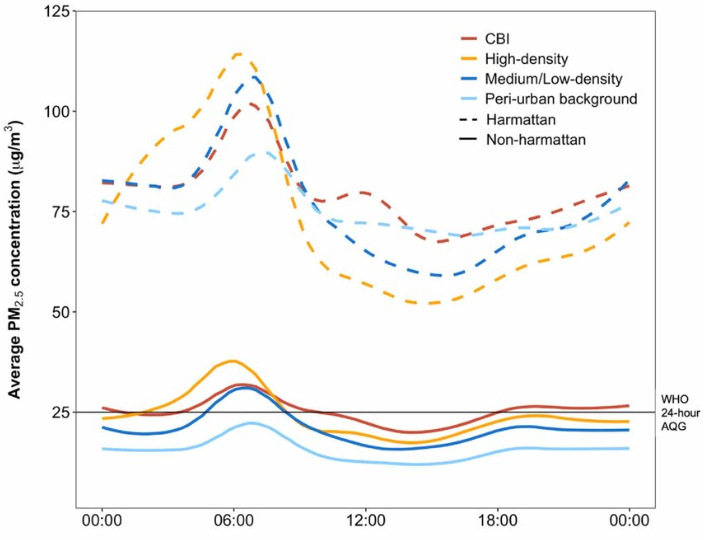

# Time proportion plots

`time_proportion_plot()` shows how pollutant totals or means are split over time by a conditioning variable.

{ width="460" }

Typical uses:

- by monitoring site
- by source cluster
- by wind-direction sector
- by wind-speed class or another numeric covariate

## How To Read The Plot

Each stacked bar corresponds to one resampled interval such as a week or month.

The bar height represents the interval total or mean for the pollutant, while the segments show how much of that interval is associated with each category or bin in the conditioning variable.

## Example

```python
import airqoair as aq

aq.time_proportion_plot(
    "kampala.csv",
    pollutant="pm2_5",
    proportion="site_name",
    avg_time="7D",
).save("outputs/time_proportion_by_site.png")
```
