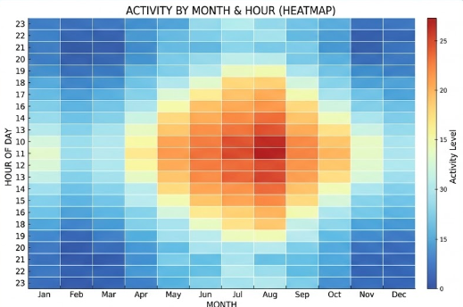

# Trend level

`trend_level()` produces a two-dimensional trend heat map for a pollutant across two axes such as month and hour, weekday and season, or two existing data columns.

{ width="460" }

Use it when you want to answer questions such as:

- during which months and hours are concentrations highest?
- how do weekdays compare across the day?
- how does a pollutant vary across wind sector and season?

## Typical Axis Choices

- `x="month", y="hour"` for a classic seasonal-by-diurnal view
- `x="weekday", y="hour"` for workweek structure
- `x="season", y="wd"` for season-by-direction structure
- `x=` or `y=` set to an existing column when you already have a categorical grouping in the data

## Example

```python
import airqoair as aq

aq.trend_level(
    "kampala.csv",
    pollutant="pm2_5",
    x="month",
    y="hour",
    statistic="mean",
).save("outputs/trend_level_month_hour.png")
```

Conditioned example:

```python
import airqoair as aq

aq.trend_level(
    "kampala.csv",
    pollutant="pm2_5",
    x="month",
    y="hour",
    group_by="site_name",
).save("outputs/trend_level_by_site.png")
```
